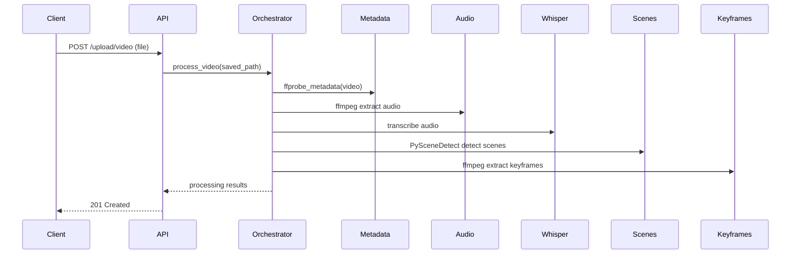

# Milestone 3 Engineering Report — VideoMind AI Backend

Date: 2026-08-17

## Milestone summary

Milestone 3 transforms the single-run processing orchestrator into a pluggable pipeline and implements two computer-vision processing stages:
- Scene detection using PySceneDetect (lazy import)
- Keyframe extraction using `ffmpeg` to capture a representative frame per scene

It also exposes scene metadata via a new API endpoint and adds configuration, tests, and documentation.

## Files created

- `app/services/pipeline.py` — Pipeline, PipelineStage, ProcessingContext
- `tests/test_pipeline.py` — pipeline ordering test
- `tests/test_scene_detection_stage.py` — unit test for `SceneDetectionStage` (injects fake scenedetect)
- `tests/test_keyframe_stage.py` — unit test for `KeyframeExtractionStage` (mocks `ffmpeg`)
- `tests/test_scenes_api.py` — API tests for scenes endpoint
- `MILESTONE3_REPORT.md` — this report

## Files modified

- `app/services/stages.py` — added `SceneDetectionStage`, `KeyframeExtractionStage`, updated to use settings
- `app/services/orchestrator.py` — now constructs and runs `Pipeline` composed of stages
- `app/services/pipeline.py` — new pipeline implementation
- `app/api/videos.py` — added `GET /videos/{video_id}/scenes` and used settings for scenes_dir
- `app/api/uploads.py` — unchanged entry but now calls orchestrator which runs pipeline
- `app/core/config.py` — added `scenes_dir`, `keyframes_dir`, `scene_threshold`, `max_scenes`
- `app/services/whisper_service.py` — singleton Whisper model manager (existing)
- `backend/README.md` — documented Milestone 3 changes
- `tests/*` — added/updated tests described above

## Updated folder tree (top-level `backend` subset)

```
backend/
  app/
    api/
      uploads.py
      videos.py
    core/
      config.py
      logger.py
    services/
      pipeline.py
      stages.py
      orchestrator.py
      media.py
      whisper_service.py
      storage.py
    utils/
      files.py
      exceptions.py
  data/
    videos/
    metadata/
    audio/
    transcripts/
    scenes/
    keyframes/
  tests/
    test_pipeline.py
    test_scene_detection_stage.py
    test_keyframe_stage.py
    test_scenes_api.py
  README.md
  MILESTONE3_REPORT.md
```

## Updated architecture diagram

```mermaid
flowchart TD
  Upload[POST /upload/video] --> SaveVideo[Save to data/videos]
  SaveVideo --> Orchestrator[Orchestrator / Pipeline Runner]
  Orchestrator --> MetadataStage[MetadataStage]
  Orchestrator --> AudioStage[AudioExtractionStage]
  Orchestrator --> WhisperStage[WhisperStage]
  Orchestrator --> SceneStage[SceneDetectionStage]
  Orchestrator --> KeyframeStage[KeyframeExtractionStage]
  SceneStage --> ScenesFS[data/scenes/*.json]
  KeyframeStage --> KeyframesFS[data/keyframes/*.jpg]
  WhisperStage --> TranscriptsFS[data/transcripts/*.json]
  API_Videos[GET /videos/{id}/scenes] --> ScenesFS
  API_Videos2[GET /videos/{id}/transcript] --> TranscriptsFS
```

## Processing pipeline diagram



## Execution flow

1. Client uploads video to `POST /upload/video`.
2. Server validates and saves the file to `data/videos/<uuid>.ext`.
3. `process_video` builds a `ProcessingContext` and runs the `Pipeline` with the stages in order:
   - MetadataStage: runs `ffprobe` to collect metadata and writes `data/metadata/<basename>.json`.
   - AudioExtractionStage: runs `ffmpeg` to extract audio to `data/audio/<basename>.wav`.
   - WhisperStage: uses singleton Whisper model to transcribe audio, writes `data/transcripts/<id>.json`.
   - SceneDetectionStage: lazily imports PySceneDetect, detects scenes, writes per-scene JSON and summary to `data/scenes/<video_id>.json`.
   - KeyframeExtractionStage: uses `ffmpeg` to extract a mid-frame image per scene into `data/keyframes/`.
4. Each stage updates `ProcessingContext` with artifacts and `ctx.results` tracks produced paths.
5. The orchestrator returns a summary including `results` and `times` per stage.

## Data flow

- Input: uploaded video binary stored in `data/videos/`.
- Derived artifacts:
  - Metadata JSON (`data/metadata/<name>.json`)
  - Audio WAV (`data/audio/<name>.wav`)
  - Transcript JSON (`data/transcripts/<id>.json`)
  - Per-scene JSONs and summary (`data/scenes/<id>_sceneNNN.json`, `data/scenes/<id>.json`)
  - Keyframe JPGs (`data/keyframes/<id>_sceneNNN.jpg`)

All artifacts are written to disk for inspection and later retrieval through APIs.

## Scene detection explanation

- Implementation: `SceneDetectionStage` lazily imports the `scenedetect` package to avoid mandatory runtime dependency during tests and lightweight runs.
- It constructs a `VideoManager` and `SceneManager`, adds a `ContentDetector(threshold=scene_threshold)` and runs detection.
- The detected scene list is converted to a list of start/end times (seconds) and durations; per-scene JSON files and a summary file are persisted.
- The summary includes `scene_id`, `start`, `end`, and `keyframe` filename for each scene.

Rationale: PySceneDetect provides robust content-based scene boundaries; lazy import keeps the codebase test-friendly.

## Keyframe extraction explanation

- Implementation: `KeyframeExtractionStage` expects `ctx.scene_data` to contain scene start/end times.
- For each scene, it computes the mid-time and invokes `ffmpeg -ss <mid> -i <video> -frames:v 1 -q:v 2 <out.jpg>` to extract a representative JPEG.
- Extracted keyframes are recorded in `ctx.results['keyframes']` and saved under `data/keyframes/`.

Notes: `ffmpeg` must be available on PATH. Tests mock `subprocess.run` to avoid real `ffmpeg` calls.

## Scene JSON example

`data/scenes/vid123.json` (summary):

```json
{
  "video_id": "vid123",
  "scene_count": 2,
  "scenes": [
    {"scene_id": 1, "start": 0.0, "end": 1.0, "keyframe": "vid123_scene001.jpg"},
    {"scene_id": 2, "start": 1.0, "end": 2.5, "keyframe": "vid123_scene002.jpg"}
  ]
}
```

Per-scene file example: `data/scenes/vid123_scene001.json`:

```json
{
  "scene_id": 1,
  "start": 0.0,
  "end": 1.0,
  "duration": 1.0
}
```

## API documentation

- `POST /upload/video` (multipart form `file`): saves and processes the uploaded video. Returns `201 Created` with `{"filename": "<saved-filename>"}`.
- `GET /videos/{video_id}/transcript`: returns the transcript JSON produced by Whisper.
- `GET /videos/{video_id}/scenes`: returns the scene summary JSON; per-scene files and keyframes are stored on disk.

Authentication: None currently — see Security considerations.

## Design decisions

- Pipeline pattern: stages are simple, testable units implementing `execute(ctx)` and are orchestrated by `Pipeline.run(ctx)` which times and logs each stage.
- Lazy imports: heavy CV and ASR libraries are imported lazily (or behind singletons) to avoid heavy startup costs and to simplify testing.
- Filesystem-first artifacts: intermediate artifacts are persisted so retries and debugging are easier, and individual retrieval endpoints can be added later.

## Performance considerations

- Whisper model loading is expensive; the `WhisperModelManager` singleton ensures a single model instance per process.
- PySceneDetect can be CPU and memory intensive for long videos; consider sampling, downscaling frames, or using faster detectors in production.
- I/O: writing many per-scene JSONs and keyframes can stress disk I/O for very large videos; consider batching or using a storage service (S3).

## Security considerations

- File uploads are validated by extension and content-type, but additional checks (MIME sniffing, scanning, size enforcement) are recommended.
- Currently no authentication/authorization on endpoints — add token-based auth for production.
- Ensure ffmpeg/ffprobe are invoked safely; user-controlled inputs are sanitized by using saved file paths, not direct shell interpolation.

## Scalability review

- Current design is single-process synchronous processing; for scale:
  - Offload processing to background workers (Celery, RQ) or a Kubernetes Job.
  - Store artifacts in object storage (S3) instead of local disk.
  - Use shared database for metadata and state tracking.

## Code review notes

- `app/services/stages.py` uses `settings` for scenes/keyframes directories but still uses hardcoded `data/metadata` and `data/audio` for metadata/audio; consider centralizing these too.
- Tests rely on monkeypatching heavy dependencies which keeps CI fast and stable.
- Error handling: stages raise on fatal errors and the pipeline marks `ctx.processing_status = 'failed'` and re-raises; consider more granular retry strategies.

## 20 Interview questions (with answers)

1. Q: What pattern does the pipeline implement?
   A: It implements a pipeline pattern with pluggable `PipelineStage` units and a `ProcessingContext` dataclass, allowing ordered execution, timing, and isolation of concerns.

2. Q: Why lazy import `scenedetect`?
   A: To avoid imposing optional heavy dependencies on all runtime environments and to make unit tests easier by allowing injection/mocking.

3. Q: How are intermediate artifacts stored?
   A: Written to local filesystem under `backend/data/` in dedicated folders.

4. Q: How is Whisper model loading optimized?
   A: Using a thread-safe singleton `WhisperModelManager` that loads the model once per process.

5. Q: How would you scale processing for many videos?
   A: Use background worker queues, external storage, containerized workers, and horizontal scaling with orchestration.

6. Q: What happens if ffmpeg is missing?
   A: `media._find_executable` raises RuntimeError; stages will raise and pipeline marks processing as failed.

7. Q: How are errors surfaced to clients?
   A: Upload endpoint logs errors; it still returns 201 on upload; production should surface processing errors via job/status endpoints.

8. Q: How could you improve security for uploads?
   A: Add authentication, file scanning, stricter MIME/type checks, size limits, and virus scanning.

9. Q: Why persist per-scene JSONs?
   A: For easy debugging, replay, and to allow per-scene retrieval without re-running detection.

10. Q: How are keyframes chosen?
    A: The midpoint of each detected scene is used as a representative frame.

11. Q: How would you add asynchronous/background processing?
    A: Push `process_video` to a task queue (e.g., Celery) and return a job ID; provide job status endpoints.

12. Q: How does the pipeline measure execution time?
    A: `Pipeline.run` measures per-stage execution time via `time.perf_counter()` and stores in `ctx.execution_times`.

13. Q: How are tests structured for heavy dependencies?
    A: Tests monkeypatch the heavy libs and subprocess calls to simulate behavior deterministically.

14. Q: What are the risks of using local disk for artifacts?
    A: Limited space, lack of redundancy, cross-host access issues in distributed deployments.

15. Q: How to add streaming transcript generation?
    A: Stream Whisper segment outputs to a websocket or chunked API as segments are produced.

16. Q: How to validate scene detection accuracy?
    A: Compare against ground-truth annotations, tune `scene_threshold`, or use alternative detectors.

17. Q: How to support other keyframe heuristics?
    A: Add strategy hooks to KeyframeExtractionStage (first-frame, center-face, highest-contrast).

18. Q: How to handle very long videos?
    A: Segment into chunks, downsample frames, or use shorter models for transcription.

19. Q: How to test end-to-end with real binaries?
    A: Use integration tests on CI runners with ffmpeg/scenedetect installed, or containerized test environments.

20. Q: What logging strategy is used?
    A: Centralized logger factory (`app.core.logger`) and per-stage logging including errors and timing.

## Remaining work before Milestone 4

- Centralize folders (metadata/audio dirs) into `Settings`.
- Add background job queue and job status endpoints (recommended for production workloads).
- Add authentication and upload quotas.
- Add integration tests that run with real `ffmpeg` and `scenedetect` in a controlled environment.
- Improve error reporting back to clients (job IDs, status polling).

---

End of report.
