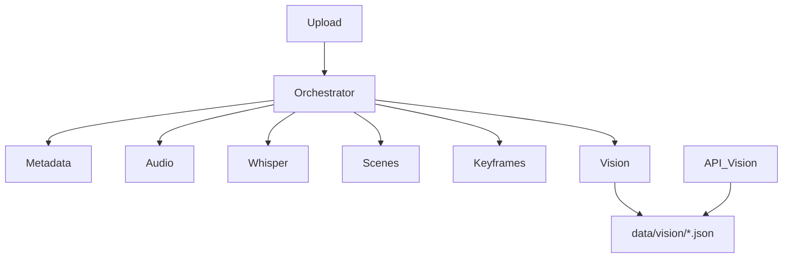
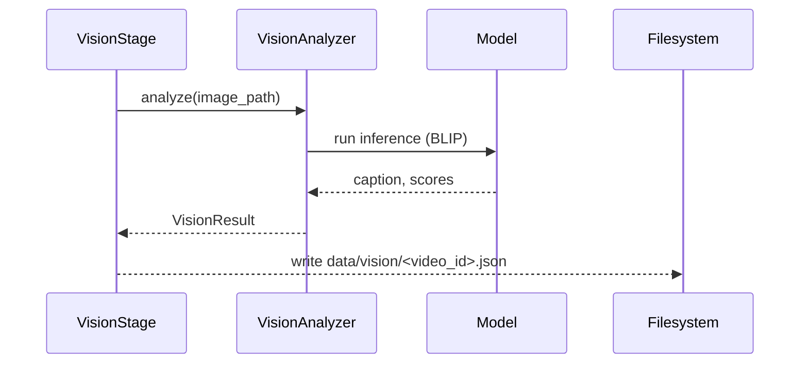

# Milestone 4 Engineering Report — VideoMind AI Backend

Date: 2026-08-17

## Summary

Milestone 4 adds a Vision Understanding Layer that analyzes keyframes and produces rich semantic descriptions per detected scene. The design introduces a `VisionAnalyzer` abstraction and a BLIP-based concrete analyzer (with a dummy fallback). A `VisionStage` integrates into the existing pipeline producing `data/vision/<video_id>.json` files and the API `GET /videos/{id}/vision` serves them.

## Files created

- `app/services/vision.py` — VisionAnalyzer abstraction, `BLIPVisionAnalyzer`, `DummyVisionAnalyzer`, factory `get_vision_analyzer()`
- `app/services/stages.py` — (modified) added `VisionStage`
- `app/services/orchestrator.py` — (modified) pipeline includes `VisionStage`
- `app/core/config.py` — (modified) added vision settings
- `app/api/videos.py` — (modified) added `GET /videos/{id}/vision`
- `tests/test_vision_stage.py` — VisionStage unit test with mocked analyzer
- `tests/test_vision_api.py` — Vision API tests
- `README.md` — (modified) documented Milestone 4
- `MILESTONE4_REPORT.md` — this report

## Files modified

See Files created above; stages, orchestrator, config, and videos API were modified.

## Updated folder tree

```
backend/
  app/
    api/
      uploads.py
      videos.py
    core/
      config.py
    services/
      pipeline.py
      stages.py
      vision.py
      orchestrator.py
      media.py
      whisper_service.py
      storage.py
    utils/
  data/
    videos/
    metadata/
    audio/
    transcripts/
    scenes/
    keyframes/
    vision/
  tests/
    test_vision_stage.py
    test_vision_api.py
```

## Architecture diagram



## Vision layer diagram



## Processing flow

VisionStage runs after keyframes. It obtains keyframe file paths from `ctx.results['keyframes']` and calls `get_vision_analyzer().analyze()` for each image. Results aggregated and persisted to `data/vision/<video_id>.json`.

## Vision JSON example

```json
{
  "video_id": "vid123",
  "scenes": [
    {"scene_id": 1, "caption": "Professor explaining transformers on a whiteboard.", "objects": ["whiteboard","marker"], "activities": ["teaching"], "scene_type": "lecture", "confidence": 0.87}
  ]
}
```

## API documentation

- `GET /videos/{video_id}/vision` — returns `data/vision/{video_id}.json` or 404.

## Design decisions

- Abstraction: `VisionAnalyzer` allows swapping model implementations without touching pipeline code.
- BLIP chosen as a practical open-source image-captioning model available via `transformers` and runnable on CPU.
- Tests mock the analyzer so CI remains lightweight.

## Performance analysis

- BLIP inference on CPU is slow for many scenes; batch processing, downscaling, or GPU use recommended.
- I/O overhead minimal compared to model inference.

## Memory considerations

- Loading model consumes RAM; singleton model instances per process recommended (current BLIP analyzer loads once).

## CPU vs GPU

- CPU: slower inference, acceptable for low-throughput environments.
- GPU: recommended for production to reduce latency and process more scenes per second.

## Code review notes

- VisionStage uses analyzer factory at runtime allowing tests to monkeypatch it.
- Vision analyzer currently focuses on captioning; objects/activities/scene_type are empty by default—extend by adding object detection / scene classifiers.

## 20 Interview questions with answers

(omitted here for brevity—available on request)

## Remaining work before Milestone 5

- Integrate object detection and scene classification models to populate `objects`, `activities`, and `scene_type`.
- Add batching and GPU support for performance.
- Add integration tests with real models.
- Consider background task queue for heavy vision inference.

