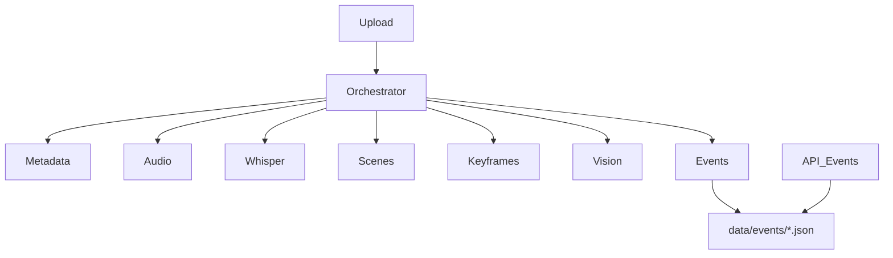
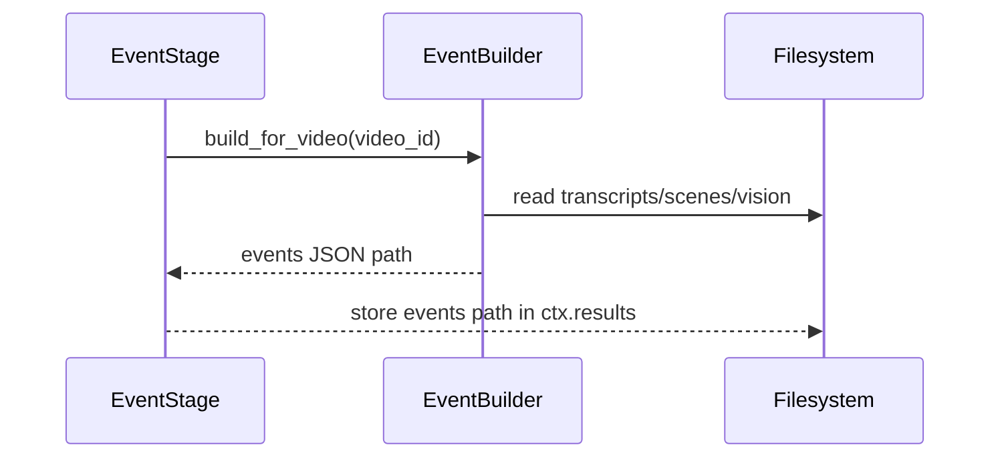

# Milestone 5 Engineering Report — VideoMind AI Backend

Date: 2026-08-17

## Summary

Milestone 5 adds an Event Builder that fuses scene metadata, transcripts, and vision outputs into structured semantic events. The EventBuilder is independent of the processing pipeline; a new `EventStage` invokes it as the final stage in the pipeline. Events are stored under `data/events/<video_id>.json` and exposed via `GET /videos/{video_id}/events`.

## Files created

- `app/services/event_builder.py` — EventBuilder class and helper `build_events_for_video()`
- `tests/test_event_builder.py` — unit test for event generation
- `tests/test_events_api.py` — API tests for events endpoint
- `MILESTONE5_REPORT.md` — this report

## Files modified

- `app/services/stages.py` — added `EventStage`, imports
- `app/services/orchestrator.py` — appended `EventStage` to pipeline
- `app/core/config.py` — added event-related settings
- `app/api/videos.py` — added `GET /videos/{id}/events` endpoint
- `README.md` — updated with Event Builder docs

## Updated folder tree (relevant subset)

```
backend/
  app/
    services/
      event_builder.py
      stages.py
      orchestrator.py
    api/
      videos.py
  data/
    events/
  tests/
    test_event_builder.py
    test_events_api.py
```

## Architecture diagram



## Event Builder diagram



## Execution flow

- `EventStage.execute(ctx)` calls `build_events_for_video(ctx.video_id)`.
- `EventBuilder` reads `data/transcripts/<id>.json`, `data/scenes/<id>.json`, and `data/vision/<id>.json` (if present), aligns transcript segments to scene timestamps, and emits one event per scene containing fused fields.
- Output persisted to `data/events/<id>.json` and path stored in `ctx.results['events_path']`.

## Event JSON example

```json
{
  "video_id": "vid123",
  "events": [
    {
      "event_id": 1,
      "scene_id": 1,
      "start": 0.0,
      "end": 18.2,
      "duration": 18.2,
      "speech": "Today we will study transformers.",
      "caption": "Professor standing beside a whiteboard.",
      "objects": ["whiteboard", "marker"],
      "activities": ["teaching"],
      "scene_type": "lecture",
      "summary": "Today we will study transformers."
    }
  ]
}
```

## Fusion strategy

- For each scene, collect transcript segments overlapping the scene interval and concatenate their text into `speech`.
- Merge vision outputs by matching `scene_id` from `data/vision/<id>.json`.
- Populate `caption`, `objects`, `activities`, `scene_type`, and `confidence` from vision results where available.
- Compute `summary` as the first 200 characters of `speech` or caption.

## Design decisions

- EventBuilder is independent; can be used offline or invoked by the pipeline.
- One event per scene keeps mapping straightforward; future work can split/merge scenes into multiple events based on semantic cues.
- No LLMs or embeddings used — summaries are simple truncations.

## Performance considerations

- EventBuilder IO bound on reading JSON files; CPU usage minimal.
- For long videos with many scenes, event generation is linear in scenes and segments.

## Scalability considerations

- Move events storage to object storage for distributed systems.
- Offload event building to background workers for large workloads.

## Code review notes

- EventBuilder uses settings defaults and logs key information.
- Error handling: missing transcripts/scenes raises FileNotFoundError; pipeline wraps exceptions.

## Remaining work before Milestone 6

- Improve event summarization (ML-based summarizers without LLMs could be added).
- Add more sophisticated merging rules (split/merge events, speaker diarization alignment).
- Add integration tests with real model outputs.

