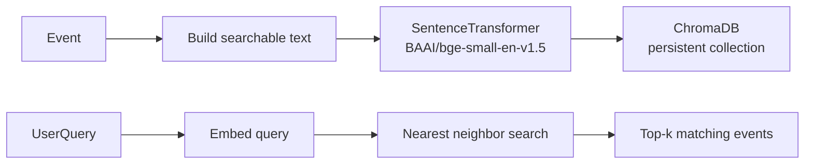

# Backend — VideoMind AI

This folder contains the FastAPI backend for Sprint 0.

## Run locally

1. Create a Python 3.11 virtual environment and activate it.
2. Install dependencies:

```bash
cd backend
python -m pip install -r requirements.txt
```

3. Run the server:

```bash
uvicorn app.main:app --reload --port 8001
```

4. Health check:

```bash
curl http://127.0.0.1:8001/health
```

## Key files

- `app/main.py`: FastAPI application entrypoint, CORS, health endpoint, exception registration.
- `app/core/config.py`: Pydantic `Settings` using `pydantic-settings` reading `.env`.
- `app/core/logger.py`: Reusable logger factory.
- `app/utils/exceptions.py`: Global exception handler registration.
- `.env.example`: Example environment variables.

## Milestone 1 — Video upload API

This milestone adds a secure video upload endpoint and media processing services.

- POST `/upload/video` — multipart file upload (`file` field). Validates extension and content-type, stores the file to `backend/data/videos`, extracts metadata via `ffprobe` and writes JSON to `backend/data/metadata/<filename>.json`, and extracts audio via `ffmpeg` to `backend/data/audio/<filename>.wav`.

Example:

```bash
curl -F "file=@/path/to/video.mp4" http://127.0.0.1:8001/upload/video
```

Dependencies:

- System binaries: `ffmpeg` and `ffprobe` must be installed and available on PATH.
	- macOS: `brew install ffmpeg`
	- Ubuntu: `sudo apt-get install ffmpeg`

The code logs errors when ffmpeg/ffprobe are not available; unit tests mock these binaries for CI.

## Milestone 3 — Scene Detection & Keyframes

This milestone adds a pluggable processing pipeline with scene detection and keyframe extraction stages, plus API endpoints for retrieving scene metadata.

- New endpoints:
	- `POST /upload/video` — upload & process video (existing); processing runs the pipeline: metadata -> audio -> whisper -> scenes -> keyframes.
	- `GET /videos/{video_id}/transcript` — returns transcript JSON.
	- `GET /videos/{video_id}/scenes` — returns scene summary JSON and per-scene files are written to disk.

- New data folders (under `backend/data/`):
	- `videos/` — uploaded videos
	- `metadata/` — ffprobe metadata JSON
	- `audio/` — extracted audio files (.wav)
	- `transcripts/` — whisper transcripts (.json)
	- `scenes/` — per-scene JSON & summary `<video_id>.json`
	- `keyframes/` — JPG keyframes extracted per scene

- New configuration options (in `app/core/config.py`):
	- `scenes_dir` (default: `data/scenes`)
	- `keyframes_dir` (default: `data/keyframes`)
	- `scene_threshold` (float, default: 30.0)
	- `max_scenes` (int, default: 1000)

- New dependencies:
	- System: `ffmpeg` and `ffprobe` on PATH
	- Python packages: `PySceneDetect` (for scene detection) and `whisper` (for ASR). In CI/tests these are monkeypatched; install for local runs as needed:

```bash
python -m pip install scenedetect[opencv]
python -m pip install -U openai-whisper
```

Note: `scenedetect[opencv]` requires system-level OpenCV prerequisites on some platforms; see PySceneDetect docs.

Testing notes:
- Unit tests mock PySceneDetect and `subprocess.run` for ffmpeg so tests are fast and CI-friendly.
- Run tests:

```bash
cd backend
python -m pytest -q
```

## Milestone 4 — Vision Understanding Layer

Milestone 4 adds a Vision layer that analyzes extracted keyframes and produces rich semantic scene descriptions. Key features:

- Vision analyzer abstraction: `app/services/vision.py` defines `VisionAnalyzer` and `VisionResult`.
- Concrete analyzer: BLIP-based `BLIPVisionAnalyzer` (configurable) and `DummyVisionAnalyzer` fallback.
- Pipeline stage: `VisionStage` appended to the processing pipeline; writes `data/vision/<video_id>.json`.
- API: `GET /videos/{video_id}/vision` returns per-video vision JSON.
- Configurable settings in `app/core/config.py`: `vision_model`, `vision_output_dir`, `vision_max_image_size`, `inference_device`.

By default the analyzer is `dummy` for CI and local runs unless a model name is set in settings or `.env`.

To enable BLIP analyzer locally, install transformers and a BLIP model:

```bash
pip install transformers[torch] pillow
# then set VISION_MODEL=Salesforce/blip-image-captioning-base in .env or Settings
```

## Milestone 6 — Semantic Search (Embeddings + Vector Database)

This milestone adds semantic retrieval to VideoMind AI. Events generated in the event-building stage are transformed into embeddings and stored in a persistent ChromaDB collection, enabling natural-language queries over video content instead of brittle keyword matching.

### How semantic search works

The pipeline now builds event metadata from transcripts, scenes, and vision output, then generates a text summary: `speech + caption + objects + activities + scene_type`. This summary is encoded by a SentenceTransformer model into a dense vector. The vector is stored in ChromaDB with metadata such as `video_id`, `event_id`, `start`, `end`, and the source text fields. Retrieval performs the same embedding for a user query, searches for nearest neighbors in the vector DB, and returns the most relevant events.

### Embedding pipeline



### Vector database

- Storage location: `backend/data/vector_db`
- Backend: `chromadb.PersistentClient`
- Collection name: `video_events`
- Stored fields: `event_id`, `video_id`, `start`, `end`, `text`, `metadata`, `embedding`

### API documentation

`POST /search`

Request body:

```json
{
  "query": "person entering kitchen",
  "top_k": 5
}
```

Response body:

```json
[
  {
    "score": 0.93,
    "video": "abc.mp4",
    "start": 12.3,
    "end": 19.7,
    "speech": "person enters kitchen",
    "vision": "someone cooking"
  }
]
```

### Configuration

The following settings are available in `app/core/config.py`:

- `embedding_model` (default: `BAAI/bge-small-en-v1.5`)
- `vector_db_path` (default: `data/vector_db`)
- `top_k_default` (default: `5`)
- `device` (default: `cpu`)

### Folder structure

```text
backend/
  app/
    api/
      search.py
    schemas/
      search.py
    services/
      embedding_service.py
      vector_store.py
      retrieval.py
  tests/
    test_embedding.py
    test_vector_store.py
    test_search_api.py
  data/
    vector_db/
```

### Example usage

```bash
curl -X POST http://127.0.0.1:8001/search \
  -H "Content-Type: application/json" \
  -d '{"query":"person entering kitchen","top_k":5}'
```

### Notes

- Embeddings are loaded lazily with a singleton `EmbeddingService`.
- The search stack is fully decoupled from the pipeline and can be reused for other document collections.
- Model loading, embedding generation, vector insertions, and retrieval timings are logged for operational monitoring.

